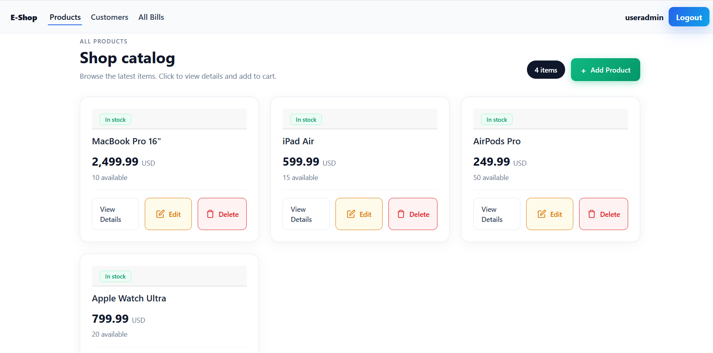
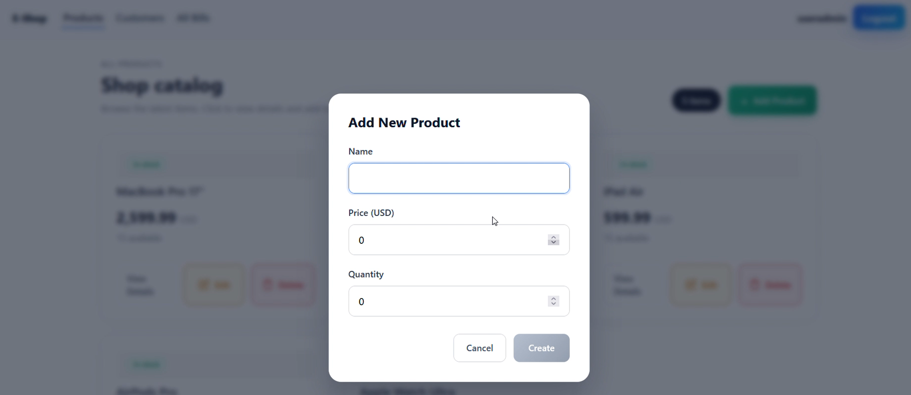
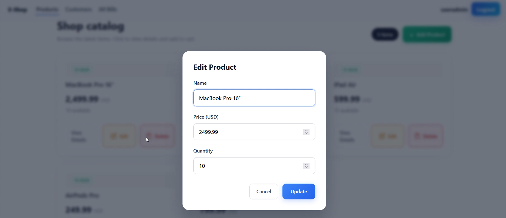
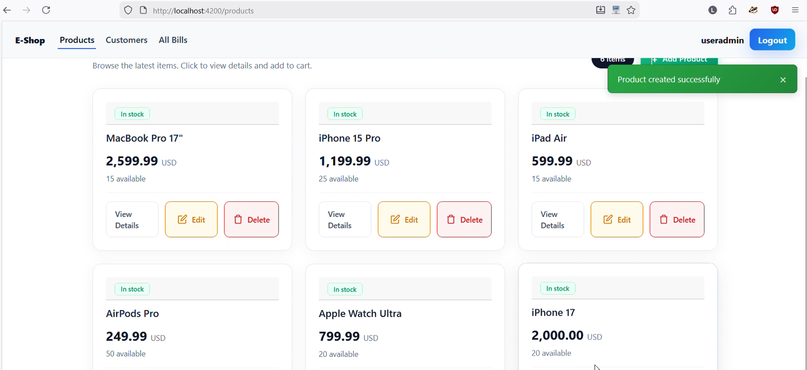
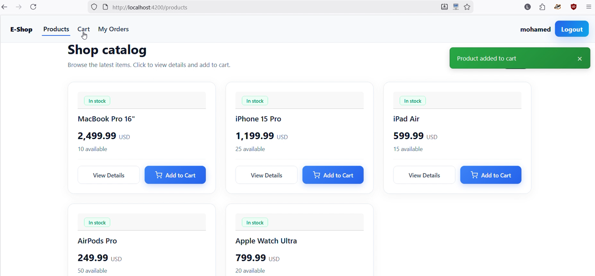
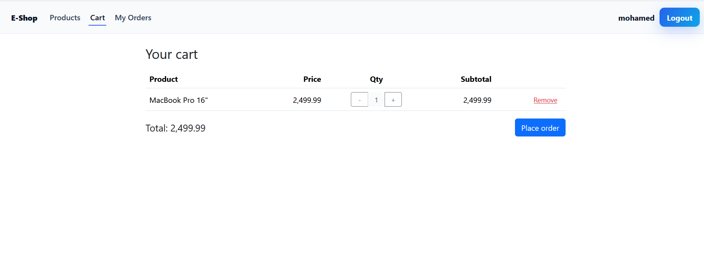
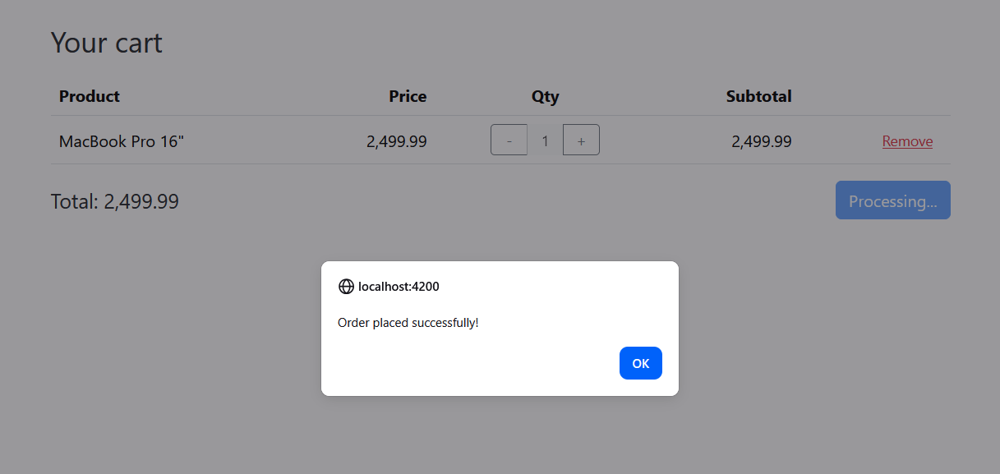
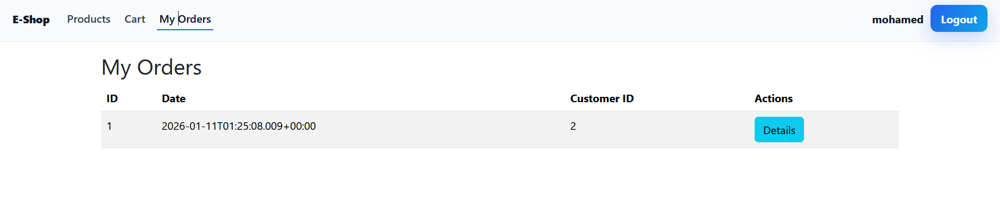
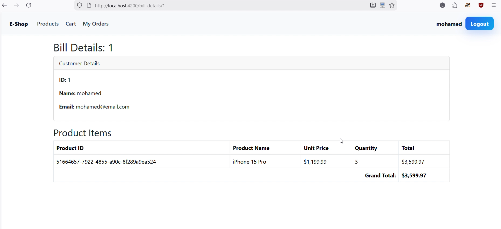

# 🛍️ E-Commerce Frontend - Angular 19

<div align="center">


**Application frontend Angular pour la plateforme e-commerce microservices**

[🔗 Backend Spring Cloud](https://github.com/MokhtarLahjaily/ecom-app)

</div>

---

## 📋 Table des Matières

- [📖 À Propos du Projet](#-à-propos-du-projet)
- [🏗️ Architecture Frontend](#️-architecture-frontend)
- [🔧 Technologies Utilisées](#-technologies-utilisées)
- [📂 Structure du Projet](#-structure-du-projet)
- [🚀 Démarrage Rapide](#-démarrage-rapide)
- [🔐 Configuration Keycloak](#-configuration-keycloak)
- [📸 Captures d'Écran & Démonstrations](#-captures-décran--démonstrations)
- [📚 Ressources Pédagogiques](#-ressources-pédagogiques)
- [👤 Auteur](#-auteur)

---

## 📖 À Propos du Projet

Ce projet académique implémente le **frontend Angular** d'une application e-commerce complète. Il consomme les APIs du backend microservices Spring Cloud et offre une interface utilisateur moderne et réactive.

### Fonctionnalités Principales

- 🛒 **Catalogue Produits** : Navigation et recherche de produits
- 🛍️ **Panier d'Achat** : Gestion du panier avec persistance localStorage
- 📦 **Commandes** : Passage et historique des commandes
- 🧾 **Factures** : Consultation des factures détaillées
- 🔐 **Authentification** : OAuth2/OIDC avec Keycloak
- 👨‍💼 **Administration** : Interface CRUD pour les produits (rôle ADMIN)

### Objectifs Pédagogiques

Ce projet a été réalisé dans le cadre du cours **J2EE** sous la supervision du **Prof. Mohamed YOUSSFI**, permettant d'acquérir des compétences sur :

- ✅ Développement Angular moderne (v19)
- ✅ State Management avec Signals
- ✅ Programmation réactive avec RxJS
- ✅ Intégration OAuth2/OIDC avec Keycloak
- ✅ Communication avec APIs REST
- ✅ Gestion des rôles et autorisations
- ✅ Interface responsive avec Bootstrap 5

---

## 🏗️ Architecture Frontend

```
┌──────────────────────────────────────────────────────────────────────────┐
│                         ARCHITECTURE FRONTEND                            │
├──────────────────────────────────────────────────────────────────────────┤
│                                                                          │
│    ┌─────────────────────────────────────────────────────────────────┐   │
│    │                     ANGULAR APPLICATION                          │   │
│    │                      (http://localhost:4200)                     │   │
│    └─────────────────────────────────────────────────────────────────┘   │
│                                    │                                     │
│         ┌──────────────────────────┼──────────────────────────┐          │
│         │                          │                          │          │
│         ▼                          ▼                          ▼          │
│    ┌─────────┐              ┌─────────────┐            ┌─────────────┐   │
│    │ Services│              │ Components  │            │  Guards &   │   │
│    │         │              │             │            │ Interceptors│   │
│    └────┬────┘              └──────┬──────┘            └──────┬──────┘   │
│         │                          │                          │          │
│         └──────────────────────────┼──────────────────────────┘          │
│                                    │                                     │
│                                    ▼                                     │
│                      ┌─────────────────────────┐                         │
│                      │    HTTP Interceptor     │                         │
│                      │    (JWT Token Auth)     │                         │
│                      └───────────┬─────────────┘                         │
│                                  │                                       │
│              ┌───────────────────┼───────────────────┐                   │
│              ▼                                       ▼                   │
│    ┌─────────────────┐                   ┌─────────────────┐             │
│    │  API Gateway    │                   │    Keycloak     │             │
│    │   :8888         │                   │     :8080       │             │
│    └─────────────────┘                   └─────────────────┘             │
│                                                                          │
└──────────────────────────────────────────────────────────────────────────┘
```

### Flux d'Authentification OAuth2

```
┌────────┐      ┌──────────────┐      ┌──────────┐      ┌─────────┐
│  User  │─────▶│   Angular    │─────▶│ Keycloak │─────▶│   API   │
│        │      │   Frontend   │      │  Server  │      │ Gateway │
└────────┘      └──────────────┘      └──────────┘      └─────────┘
     │                 │                    │                │
     │  1. Access App  │                    │                │
     │────────────────▶│                    │                │
     │                 │  2. Redirect to    │                │
     │                 │     Keycloak       │                │
     │                 │───────────────────▶│                │
     │  3. Login Form  │                    │                │
     │◀─────────────────────────────────────│                │
     │  4. Credentials │                    │                │
     │─────────────────────────────────────▶│                │
     │                 │  5. JWT Tokens     │                │
     │                 │◀───────────────────│                │
     │                 │  6. API Request    │                │
     │                 │  + Bearer Token    │                │
     │                 │───────────────────────────────────▶│
     │                 │  7. Response       │                │
     │                 │◀───────────────────────────────────│
     │  8. Display     │                    │                │
     │◀────────────────│                    │                │
```

---

## 🔧 Technologies Utilisées

### Frontend Framework
| Technologie | Version | Description |
|-------------|---------|-------------|
| **Angular** | 19.2.17 | Framework frontend moderne |
| **TypeScript** | 5.7 | Langage de programmation typé |
| **RxJS** | 7.8 | Programmation réactive |
| **Signals** | - | State management Angular natif |

### UI & Styling
| Technologie | Version | Description |
|-------------|---------|-------------|
| **Bootstrap** | 5.3.8 | Framework CSS responsive |
| **Bootstrap Icons** | 1.13.1 | Icônes vectorielles |
| **CSS3** | - | Styling personnalisé |

### Authentification & Sécurité
| Technologie | Version | Description |
|-------------|---------|-------------|
| **Keycloak-js** | 26.1.3 | Adapter OAuth2/OIDC |
| **HTTP Interceptor** | - | Injection automatique JWT |
| **Route Guards** | - | Protection des routes |

### Build & Tooling
| Technologie | Version | Description |
|-------------|---------|-------------|
| **Angular CLI** | 19.2.6 | Outil de développement |
| **Node.js** | 18+ | Runtime JavaScript |
| **npm** | 10+ | Gestionnaire de paquets |
| **Karma/Jasmine** | - | Tests unitaires |

---

## 📂 Structure du Projet

```
ecom-app-frontend/
│
├── 📁 src/
│   ├── 📁 app/
│   │   ├── 📁 bills/                 # Composant liste factures
│   │   ├── 📁 bills-details/         # Composant détail facture
│   │   ├── 📁 cart/                  # Composant panier d'achat
│   │   ├── 📁 customers/             # Composant gestion clients
│   │   ├── 📁 products/              # Composant catalogue produits
│   │   ├── 📁 product-detail/        # Composant détail produit
│   │   ├── 📁 product-form/          # Formulaire CRUD produit
│   │   │
│   │   ├── 📁 core/                  # Module core (singleton services)
│   │   ├── 📁 shared/                # Composants partagés
│   │   │
│   │   ├── 📁 services/              # Services Angular
│   │   │   ├── security.service.ts   # Service Keycloak
│   │   │   ├── product.service.ts    # API Produits
│   │   │   ├── cart.service.ts       # Gestion panier
│   │   │   ├── bill.service.ts       # API Factures
│   │   │   └── customer.service.ts   # API Clients
│   │   │
│   │   ├── 📁 interceptors/          # HTTP Interceptors
│   │   │   └── auth.interceptor.ts   # Injection JWT token
│   │   │
│   │   ├── 📁 models/                # Interfaces TypeScript
│   │   │
│   │   ├── 📄 app.config.ts          # Configuration app + Keycloak
│   │   ├── 📄 app.routes.ts          # Définition des routes
│   │   ├── 📄 app.component.ts       # Composant racine
│   │   └── 📄 app.component.html     # Template racine
│   │
│   ├── 📁 assets/                    # Ressources statiques
│   ├── 📄 index.html                 # Page HTML principale
│   ├── 📄 main.ts                    # Point d'entrée
│   └── 📄 styles.css                 # Styles globaux
│
├── 📁 captures/                      # Screenshots documentation
├── 📄 angular.json                   # Configuration Angular
├── 📄 package.json                   # Dépendances npm
├── 📄 tsconfig.json                  # Configuration TypeScript
└── 📄 README.md
```

---

## 🚀 Démarrage Rapide

### Prérequis

| Outil | Version | Vérification |
|-------|---------|--------------|
| 📦 **Node.js** | 18+ | `node --version` |
| 📦 **npm** | 10+ | `npm --version` |
| 🅰️ **Angular CLI** | 19+ | `ng version` |
| 🐋 **Backend** | - | Docker Compose lancé |

### Installation

```bash
# Cloner le repository
git clone https://github.com/MokhtarLahjaily/ecom-app-frontend.git
cd ecom-app-frontend

# Installer les dépendances
npm install

# Démarrer en mode développement
ng serve
```

L'application sera accessible sur **http://localhost:4200**

### Build Production

```bash
# Build optimisé pour la production
ng build --configuration production

# Les fichiers seront dans dist/ecom-app-frontend/
```

### Commandes Utiles

```bash
# Démarrer le serveur de développement
ng serve

# Démarrer avec ouverture automatique du navigateur
ng serve --open

# Build de développement avec watch
ng build --watch

# Lancer les tests unitaires
ng test

# Lancer les tests avec couverture
ng test --code-coverage

# Générer un nouveau composant
ng generate component nom-composant

# Générer un nouveau service
ng generate service nom-service
```

---

## 🔐 Configuration Keycloak

### Configuration dans l'Application

La configuration Keycloak se trouve dans `src/app/app.config.ts` :

```typescript
import Keycloak from 'keycloak-js';

export const keycloak = new Keycloak({
  url: 'http://localhost:8080',      // URL du serveur Keycloak
  realm: 'ecom-realm',                // Nom du Realm
  clientId: 'ecom-app-frontend'       // ID du Client
});

// Initialisation avec les options
keycloak.init({
  onLoad: 'login-required',           // Forcer l'authentification
  checkLoginIframe: false,
  pkceMethod: 'S256'                  // PKCE pour sécurité SPA
});
```

### Prérequis Backend

⚠️ **Important** : Avant de démarrer le frontend, assurez-vous que :

1. ✅ Le backend Docker Compose est lancé
2. ✅ Keycloak est accessible sur http://localhost:8080
3. ✅ Le Realm `ecom-realm` est créé
4. ✅ Le Client `ecom-app-frontend` est configuré

### Configuration Client Keycloak

| Paramètre | Valeur |
|-----------|--------|
| **Client ID** | `ecom-app-frontend` |
| **Client Protocol** | openid-connect |
| **Access Type** | public |
| **Valid Redirect URIs** | `http://localhost:4200/*` |
| **Web Origins** | `http://localhost:4200` |
| **Standard Flow** | Enabled |

---

## 📸 Captures d'Écran & Démonstrations

### 1️⃣ Interface Administrateur - Gestion des Produits

#### Liste des Produits (Vue Admin)



> **📸 Figure 1** : Interface d'administration des produits. L'administrateur peut voir tous les produits avec les options d'**édition** et de **suppression**. Le bouton "Ajouter un produit" permet d'accéder au formulaire de création. Cette vue n'est accessible qu'aux utilisateurs ayant le rôle **ADMIN**.

---

#### Formulaire d'Ajout de Produit



> **📸 Figure 2** : Formulaire de création d'un nouveau produit. Les champs incluent le **nom**, le **prix** et la **quantité** en stock. La validation des formulaires Angular garantit que les données saisies sont correctes avant soumission.

---

#### Formulaire d'Édition de Produit



> **📸 Figure 3** : Formulaire d'édition d'un produit existant. Les valeurs actuelles sont pré-remplies dans le formulaire. L'administrateur peut modifier le **nom**, le **prix** ou la **quantité** puis sauvegarder les changements.

---

#### Notification - Produit Créé



> **📸 Figure 4** : Notification toast confirmant la **création réussie** d'un nouveau produit. Les notifications toast sont non-bloquantes et disparaissent automatiquement après quelques secondes, offrant un feedback utilisateur discret mais visible.

---

#### Notification - Produit Modifié


> **📸 Figure 5** : Notification toast confirmant la **mise à jour réussie** d'un produit. Le système de toast utilise Bootstrap pour un design cohérent avec le reste de l'interface.

---

### 2️⃣ Gestion des Utilisateurs Keycloak


> **📸 Figure 6** : Vue de la liste des utilisateurs depuis l'interface admin. Cette fonctionnalité permet de visualiser les utilisateurs enregistrés dans Keycloak, avec leurs informations de profil récupérées via l'API.

---

### 3️⃣ Expérience Utilisateur - Achat

#### Ajout au Panier



> **📸 Figure 7** : Notification toast confirmant l'**ajout d'un produit au panier**. L'utilisateur reçoit un feedback immédiat lorsqu'il clique sur le bouton "Ajouter au panier", améliorant l'expérience utilisateur.

---

#### Visualisation du Panier



> **📸 Figure 8** : Interface du panier d'achat. L'utilisateur peut voir tous les produits ajoutés avec leurs **quantités**, **prix unitaires** et le **total**. Les options permettent de modifier les quantités ou de supprimer des articles. Le panier est persisté dans **localStorage** pour survivre aux rechargements de page.

---

### 4️⃣ Gestion des Commandes et Factures

#### Confirmation de Commande



> **📸 Figure 9** : Écran de confirmation après la création d'une commande. Le système affiche les détails de la commande créée, incluant le **numéro de facture** généré. L'utilisateur peut accéder aux détails de sa facture depuis cet écran.

---

#### Facture Générée



> **📸 Figure 10** : Vue de la facture générée après une commande. La facture affiche toutes les informations essentielles : **date de facturation**, **client**, **liste des produits**, **quantités** et **montant total**.

---

#### Détails de la Facture



> **📸 Figure 11** : Vue détaillée d'une facture avec tous les articles commandés. Chaque ligne affiche le **nom du produit**, le **prix unitaire**, la **quantité** commandée et le **sous-total**. Cette vue permet à l'utilisateur de consulter l'historique complet de ses achats.

---

## 👥 Utilisateurs de Test

| Utilisateur | Mot de passe | Rôle | Permissions |
|-------------|--------------|------|-------------|
| `user1` | `1234` | USER | Voir produits, Ajouter au panier, Commander |
| `admin1` | `1234` | ADMIN | Tout + CRUD Produits, Voir utilisateurs |

---

## 📡 Communication avec le Backend

L'application communique avec l'API Gateway backend sur `http://localhost:8888`

### Endpoints Consommés

```typescript
// Products (Inventory Service)
GET    /INVENTORY-SERVICE/api/products       // Liste produits
GET    /INVENTORY-SERVICE/api/products/{id}  // Détail produit
POST   /INVENTORY-SERVICE/api/products       // Créer (ADMIN)
PUT    /INVENTORY-SERVICE/api/products/{id}  // Modifier (ADMIN)
DELETE /INVENTORY-SERVICE/api/products/{id}  // Supprimer (ADMIN)

// Customers (Customer Service)
GET    /CUSTOMER-SERVICE/api/customers       // Liste clients
GET    /CUSTOMER-SERVICE/api/customers/search/current-user // Client courant

// Bills (Billing Service)
GET    /BILLING-SERVICE/api/bills            // Mes factures
GET    /BILLING-SERVICE/api/bills/{id}       // Détail facture
POST   /BILLING-SERVICE/api/bills            // Créer commande
```

---

## 📚 Ressources Pédagogiques

Ce projet a été réalisé en suivant les tutoriels du **Prof. Mohamed YOUSSFI** :

| Partie | Sujet | Lien |
|--------|-------|------|
| **Angular Basics** | Concepts de base Angular | [📹 YouTube](https://www.youtube.com/watch?v=7cy5MMkoMTo) |
| **Frontend E-com** | Client Angular Microservices | [📹 YouTube](https://www.youtube.com/watch?v=iMCjDRUXoeM) |
| **Keycloak Angular** | Sécurisation Frontend | [📹 YouTube](https://www.youtube.com/watch?v=YQRYMKbfJTA) |

### ✅ Travaux Réalisés

- [x] Configuration projet Angular 19
- [x] Intégration Keycloak-js pour OAuth2/OIDC
- [x] HTTP Interceptor pour injection JWT
- [x] Route Guards pour protection des routes
- [x] Composant Products avec catalogue
- [x] Composant Cart avec persistance localStorage
- [x] Composant Orders pour historique commandes
- [x] Composant Bills pour consultation factures
- [x] Interface Admin avec CRUD produits
- [x] Système de notifications Toast
- [x] Gestion des rôles (USER/ADMIN)
- [x] Design responsive avec Bootstrap 5

---

## ✨ Fonctionnalités

- ✅ **Authentification OAuth2/OIDC** avec Keycloak
- ✅ **State Management** avec Angular Signals
- ✅ **Programmation Réactive** avec RxJS
- ✅ **Interface Responsive** avec Bootstrap 5
- ✅ **Notifications Toast** non-bloquantes
- ✅ **Skeleton Loading** pour meilleur UX
- ✅ **Gestion des Rôles** (USER/ADMIN)
- ✅ **Panier Persistant** avec localStorage
- ✅ **Navigation Hamburger** responsive
- ✅ **Formulaires Réactifs** avec validation

---

## 🔗 Liens Utiles

- 🔙 **Backend Spring Cloud** : [https://github.com/MokhtarLahjaily/ecom-app](https://github.com/MokhtarLahjaily/ecom-app)
- 📖 **Repository Prof. YOUSSFI** : [https://github.com/mohamedYoussfi/micro-services-app](https://github.com/mohamedYoussfi/micro-services-app)

---

## 👤 Auteur

<div align="center">

**Mohamed Mokhtar LAHJAILY**

🎓 Étudiant Ingénieur - 5ème Année (5IIR)  
🏫 École Marocaine des Sciences de l'Ingénieur (EMSI)  
📅 Année Académique 2025/2026  
📚 Module : J2EE - Architecture Microservices

[](https://github.com/MokhtarLahjaily)

</div>

---

## 🙏 Remerciements

Un grand merci au **Prof. Mohamed YOUSSFI** pour ses tutoriels détaillés et son accompagnement pédagogique tout au long de ce projet.

---

## 📄 Licence

Ce projet est réalisé dans un cadre académique sous la supervision du **Prof. Mohamed YOUSSFI** à l'EMSI.

---

<div align="center">

**⭐ Si ce projet vous a été utile, n'hésitez pas à lui donner une étoile ! ⭐**

</div>
